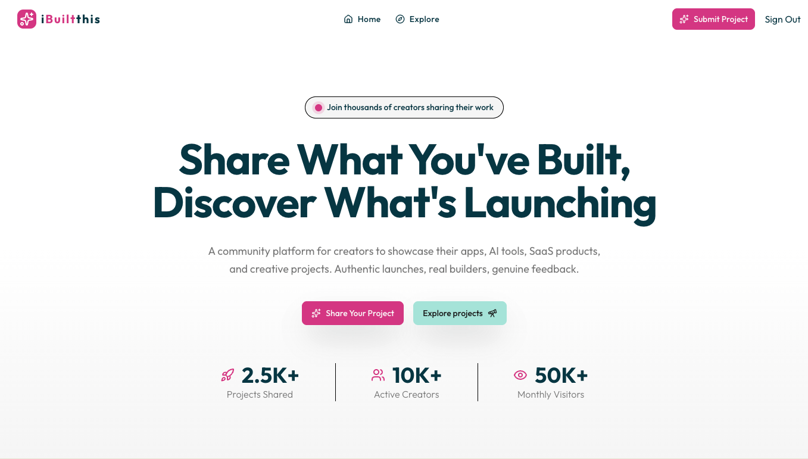
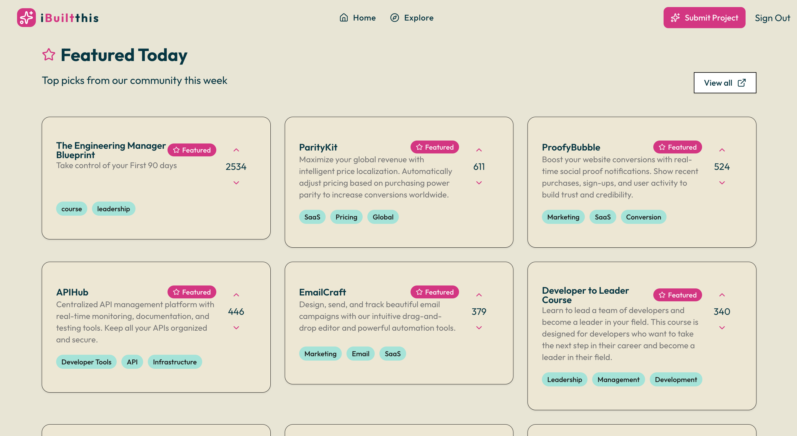
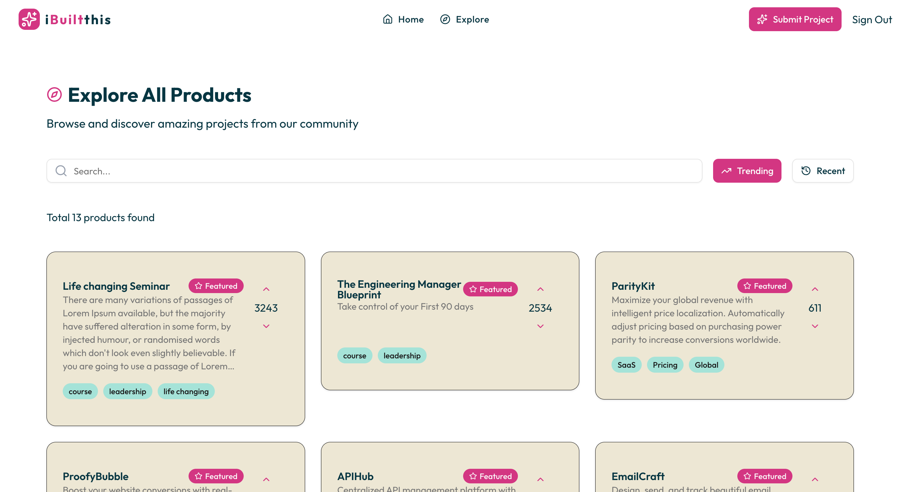
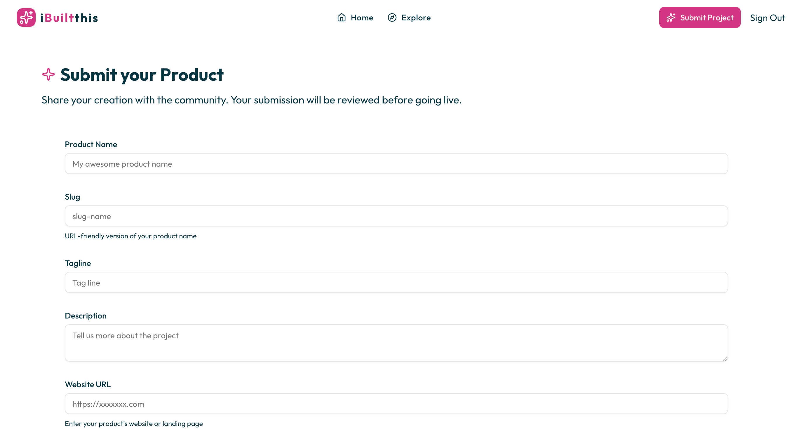
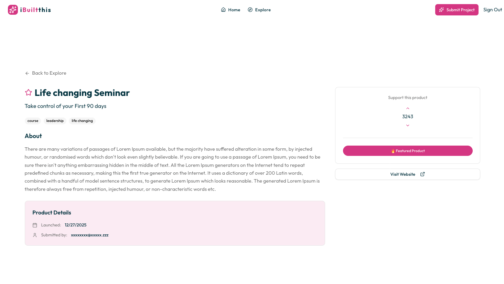
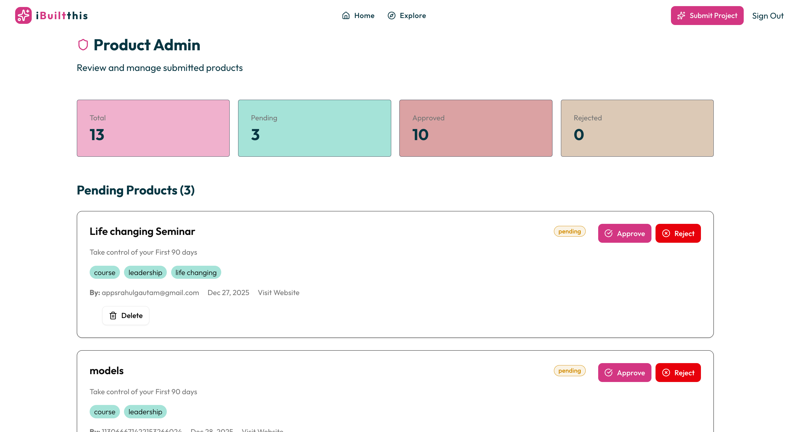

### ✨ A Community Platform for Builders, Indie Hackers & Creators

<!-- 🚀 CTA BUTTONS -->

  
  &nbsp;&nbsp;
  

**Showcase Products · Discover Ideas · Build in Public**

---

## 🌟 Project Overview (Client-Focused)

**iBuiltThis** is a **production-ready community platform** that allows creators to showcase  
their **apps, AI tools, SaaS products, and creative projects** in one place.

The platform is designed to:
- Increase creator visibility
- Encourage building in public
- Maintain quality through admin moderation

It includes a **public product discovery website** and a **secure admin dashboard**.

---

## ⚡ Key Features

### 👤 Creator Experience
- 🔐 Secure authentication
- ➕ Submit and manage products
- 📦 Edit or remove submissions
- 🔍 Explore community-built projects
- 🧠 Creator ↔ Product association

---

### 🧑‍💼 Admin Panel
- 📋 Review product submissions
- ✅ Approve / reject listings
- ✏️ Edit product metadata
- 🗑️ Remove spam or low-quality entries
- 🛡️ Platform moderation controls

---

### 🛠️ Engineering Highlights
- ✅ Zod-based schema validation
- 🗄️ PostgreSQL + Drizzle ORM (type-safe)
- 🎨 Modern UI using Tailwind CSS
- ⚡ Fast, SEO-friendly Next.js pages
- 🔒 Production-grade architecture
- ☁️ Deployed on Vercel

---

## 🏗️ Tech Stack

| Layer | Technology |
|-----|-----------|
| Framework | Next.js |
| UI Library | React.js |
| Language | TypeScript |
| Styling | Tailwind CSS |
| Database | PostgreSQL |
| ORM | Drizzle ORM |
| Validation | Zod |
| Deployment | Vercel |

---

## 📸 Screenshots & Product Preview

> _Replace image paths with your actual screenshots_

### 🏠 Landing Page
**Browse apps, SaaS products, and AI tools built by creators**

---

### 🏠 Featured products
**Featured products**

---

### 🏠 Explore Products
**Browse apps, SaaS products, and AI tools built by creators**

---

### ➕ Submit a Product
**Creators can submit and manage their projects**

---

### 📦 Product Details
**Detailed product page with creator information**

---

### 🧑‍💼 Admin Dashboard
**Moderate, approve, and manage submissions**

---

## 💼 Portfolio 

✔ Demonstrates full-stack SaaS architecture  
✔ Real-world admin & user workflows  
✔ Clean UI / UX principles  
✔ Scalable & maintainable codebase  
✔ Ideal for startups, MVPs & creator platforms  

---

<!-- 🌊 Animated Footer -->

  <b>⭐ Star this repo if you love building in public</b>   
  <b>Made with love by Rahul Gautam</b>

